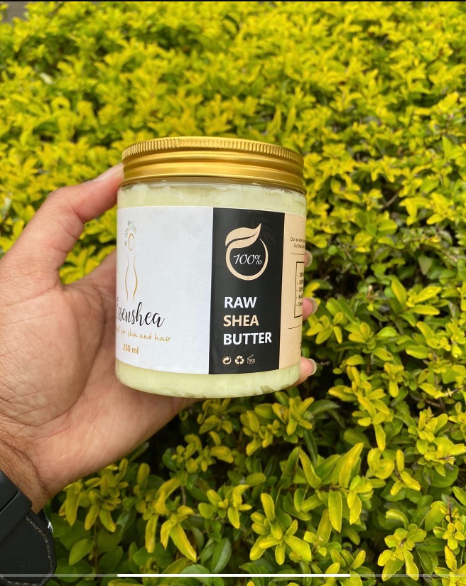
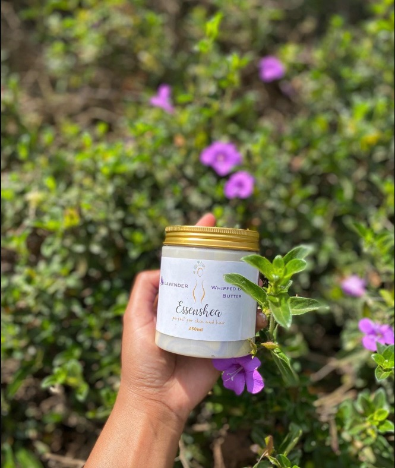
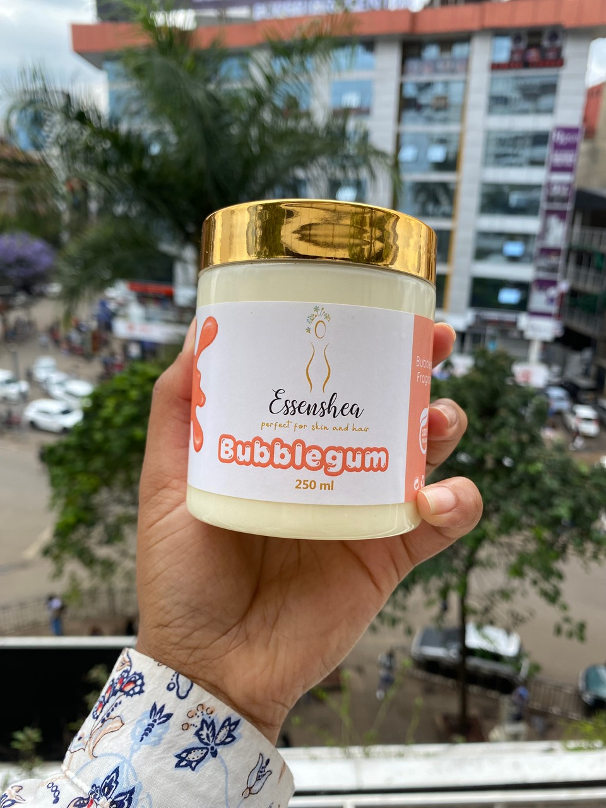
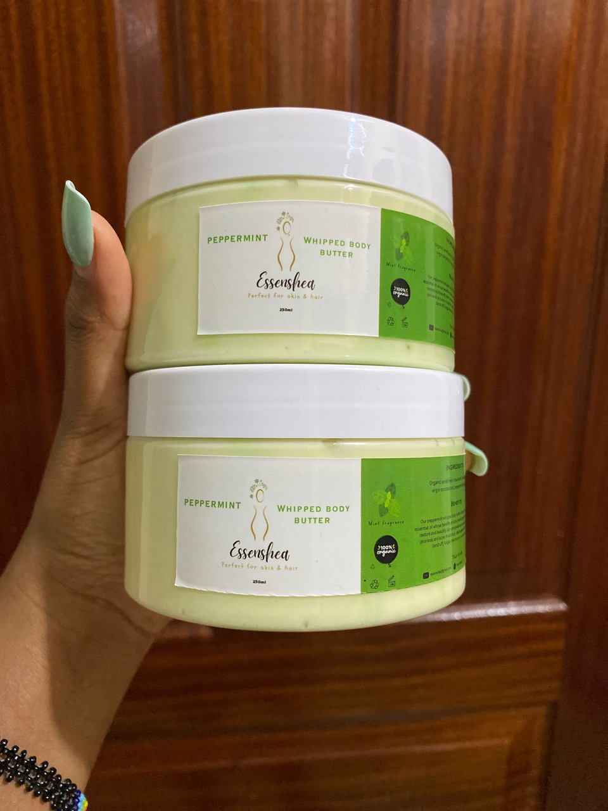
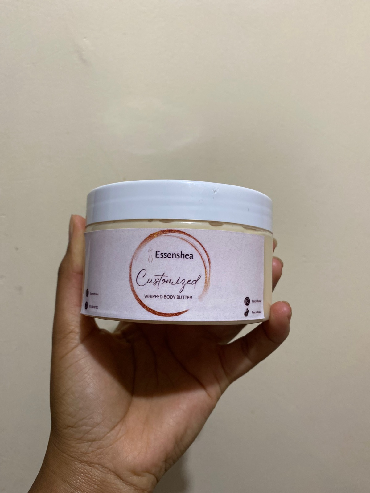
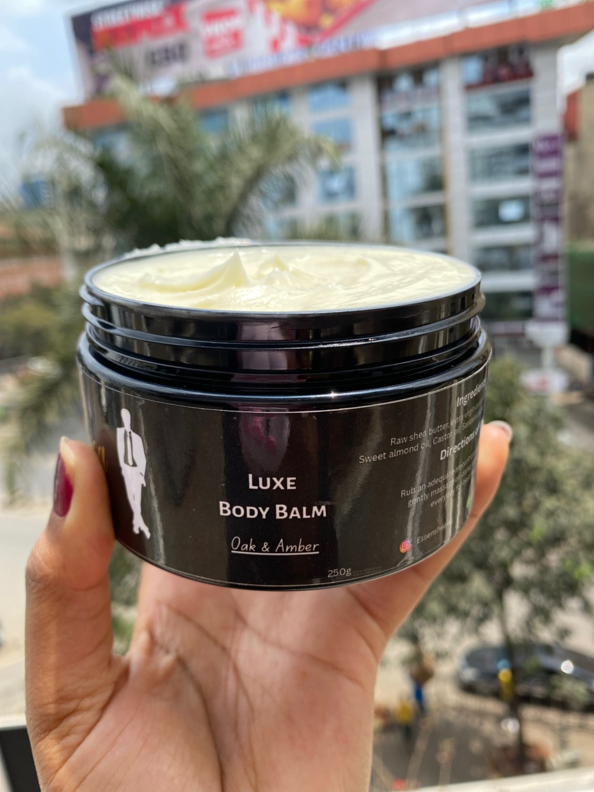
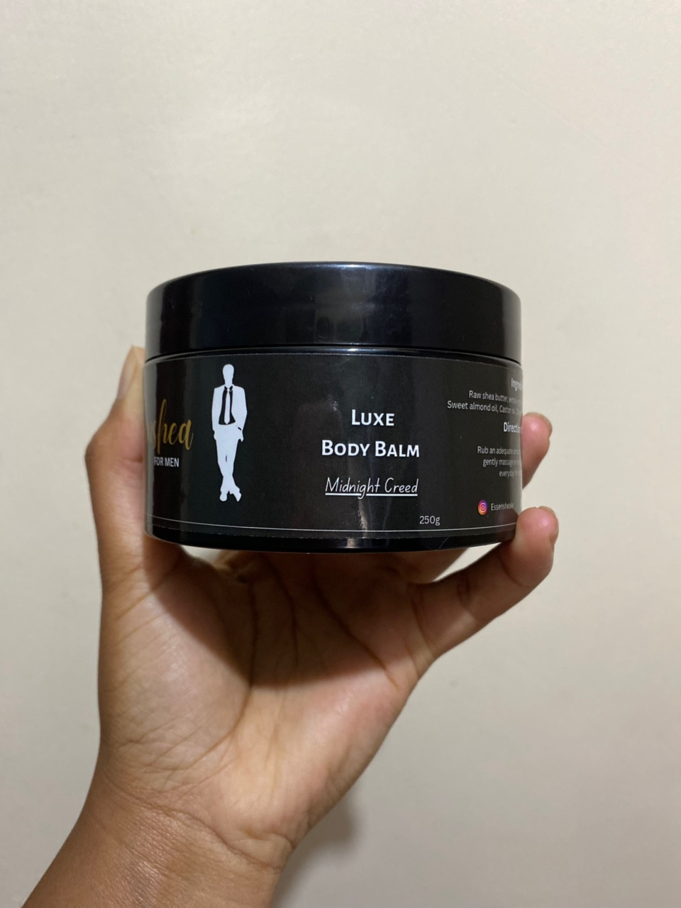
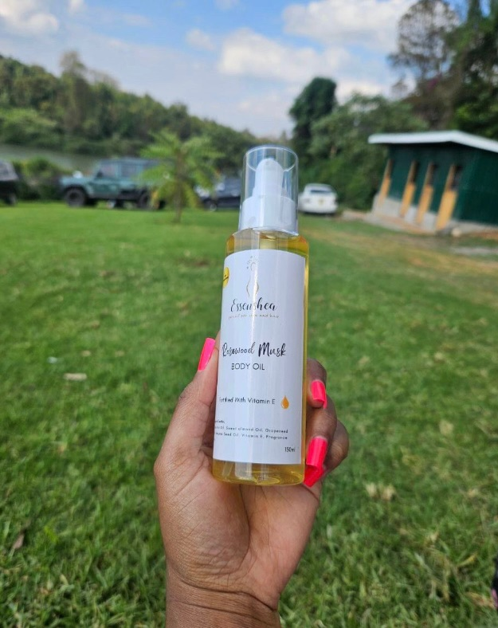

# Body Butters & Balms

**Business:** Essenshea.ke
**Contact:** +254 727 349749 | Till: 9402567
**Description:** Wholesale and retail of natural organic shea butter, organic powders, essential oils, carrier oils, hair growth oils, body oils, soap bars and custom body care.

---

## Raw Whipped Shea Butter 250ml

Ingredients: shea butter, olive oil, coconut oil. Raw, no additives. Perfect for acne and rashes. Fades stretch marks and dark spots. Moisturizes the skin and scalp. Gives skin a youthful look. Fights eczema and psoriasis. Soothes inflammation.
KES 850.00

---

## Lavender Whipped Shea Butter 250ml

Ingredients: shea butter, olive oil, coconut oil, lavender essential oil. Fades stretch marks. Relaxing and calming benefits of lavender. Soothes inflammation. Treats eczema and acne. Moisturizes skin and scalp. Promotes healthy hair growth. Heals wounds and scrapes. Gives skin a youthful look.
KES 850.00

---

## Bubblegum Whipped Shea Butter 250ml

Ingredients: shea butter, olive oil, coconut oil, bubblegum fragrance. No chemical additives or preservatives. Sweet scent. Perfect for all skin types. Fades stretch marks. Soothes inflammation. Gentle on the skin. Gives skin a youthful look. Brightens dull-looking skin.
KES 850.00

---

## Peppermint Whipped Shea Butter 250ml

Ingredients: shea butter, olive oil, coconut oil, peppermint essential oil. No chemical additives. Calming and soothing on skin. Natural deodorant. Soothes itchiness and inflammation. Moisturizes skin, scalp and hair. Gives skin and hair a healthy glow. Fades stretch marks. Helps manage eczema, acne and psoriasis.
KES 850.00

---

## Customized Whipped Shea Butter

An option to customize a body butter to suit your preference, available only at Essenshea. Choose your preferred butters, oils, fragrances and finish, or share the ingredients you want included. Custom products are planned and made after review. Price depends on ingredients and size. Regular prices: 250g - Ksh 1,000, 300g - Ksh 1,150, 500g - Ksh 1,550, 1kg - Ksh 2,400.

---

## Oak & Amber Body Balm for Men 250ml

Ingredients: shea butter, olive oil, coconut oil, sandalwood fragrance. Infused with sandalwood fragrance.
KES 1,000.00

---

## Midnight Creed Body Balm for Men 250ml

Ingredients: shea butter, olive oil, coconut oil, smoky chamomile fragrance. Infused with smoky chamomile fragrance.
KES 1,000.00

---

## Wood & Spice Body Balm for Men 250ml

Ingredients: shea butter, olive oil, coconut oil, cedarwood essential oil. Warm, grounded body balm for men with a wood-and-spice profile.
KES 1,000.00

---
