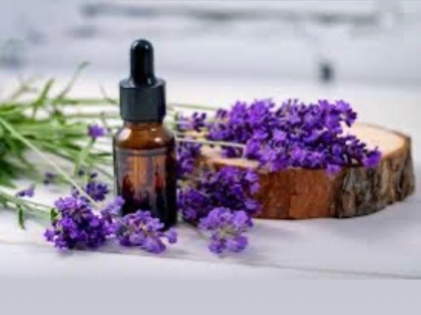
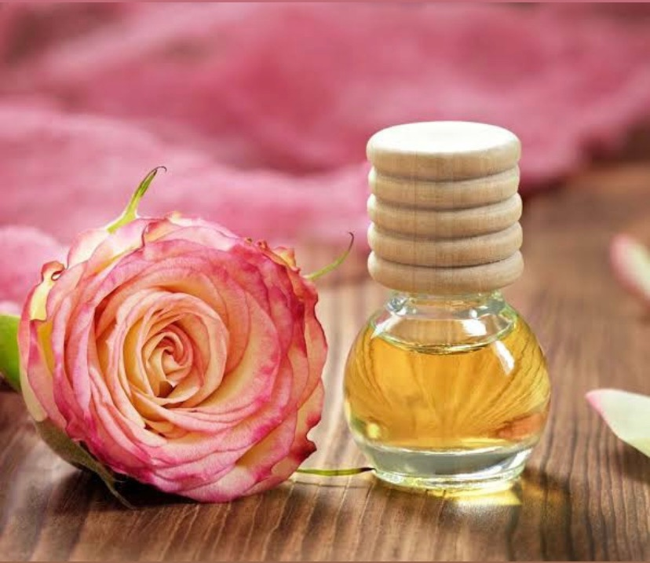
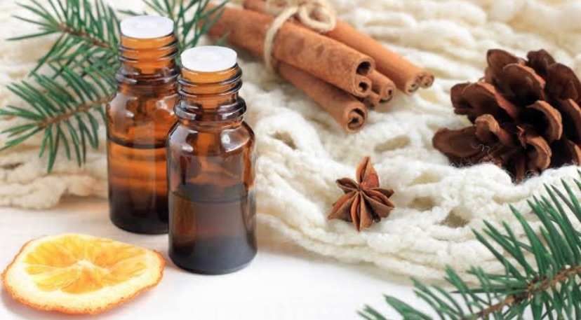
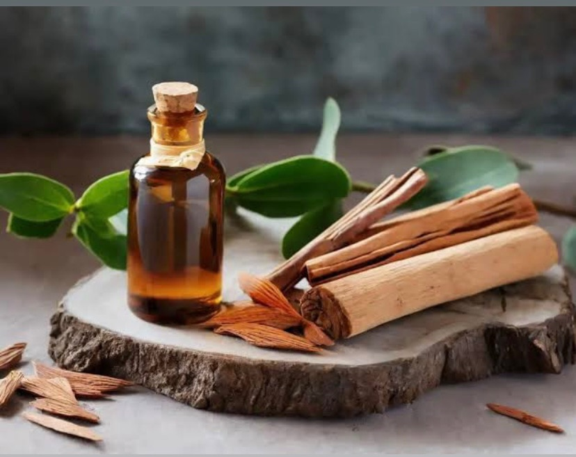

# Essential Oils

**Business:** Essenshea.ke
**Contact:** +254 727 349749 | Till: 9402567
**Description:** Wholesale & retail of natural 100% organic shea butter, organic powders, essential oils, carrier oils, hair growth oils, body oils, soap bars etc.

---

## Rose Essential Oil

10ml. Ksh 700 50ml. Ksh 1450 100ml. Ksh 2100

---

## Bergamot Essential Oil

10ml. Ksh 680 50ml. Ksh 1200 100ml. Ksh 1950

---

## Peppermint Essential Oil

10ml. Ksh 520 50ml. Ksh 1050 100ml. Ksh 1500

---

## Lavender Essential Oil

10ml. Ksh 670 50ml. Ksh 1300 100ml. Ksh 1900

---

## Rosemary Essential Oil

10ml. Ksh 570 50ml. Ksh 830 100ml. Ksh 1800

---

## Lemongrass Essential Oil

10ml. Ksh 520 50ml. Ksh 920 100ml. Ksh 1700

---

## Mint Essential Oil

10ml. Ksh 520 50ml Ksh 900 100ml. Ksh 1700

---

## Chamomile Essential Oil

10ml. Ksh 850 50ml. Ksh 2400 100ml. Ksh 4000

---

## Clove Essential Oil

10ml. Ksh 470 30ml. Ksh 1050 100ml. Ksh 1700 BENEFITS •Acne treatment. Clove oil has antimicrobial and anti-inflammatory properties, making it a potential natural remedy for acne. Diluted clove oil can be applied topically to treat acne blemishes. • Skin Infections: Its antimicrobial properties make clove oil useful for treating various skin infections, such as fungal infections or cuts and wounds. • Skin Rejuvenation: The antioxidant properties of clove oil can help combat free radicals and promote healthier, more youthful-looking skin. •Anti-Aging: Clove oil's antioxidant content may help reduce the signs of aging, such as wrinkles and fine lines. • Skin Irritations: It can provide relief from skin irritations and itchiness, particularly when diluted and applied to the affected areas. •Promotes Hair Growth: Clove oil can improve blood circulation to the scalp, which may promote hair growth. It's often used in hair care products for this purpose. •Dandruff Treatment: Clove oil's antimicrobial properties can help combat dandruff and flaky scalp conditions. It can be added to your regular shampoo or diluted in a carrier oil and massaged onto the scalp. •Hair Conditioning: When diluted with a carrier oil, clove oil can serve as a hair conditioner. It helps with frizz and improve the overall texture of your hair.

---

## Camphor Essential Oil

10ml. Ksh 370 30ml. Ksh 850 100ml. Ksh 1400

---

## Eucalyptus Essential Oil

10ml. Ksh 500 30ml. Ksh 980 100ml. Ksh 1600

---

## Cedarwood Essential Oil

10ml. Ksh 400 30ml. Ksh 900 100ml. 1400

---

## Tea Tree Essential Oil

10ml. Ksh 500 30ml. Ksh 1080 100ml. Ksh 1700

---

## Frankincense Essential Oil

10ml. Ksh 800 50ml. Ksh 1900 100ml. Ksh 2600

---

## Sandalwood Essential Oil

10ml. Ksh 870/- 50ml. Ksh 1900/- 100ml. Ksh 3100/-

---

## Cinnamon Bark Essential Oil

10ml. Ksh 650 50ml. Ksh 1000 100ml. Ksh 1500

---
